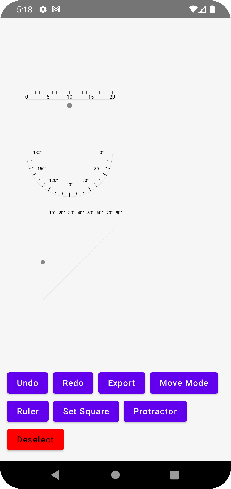

# 📏 SnappyRuler — Android Geometry Drawing Tools

SnappyRuler is an **Android app built with Jetpack Compose + MVVM** that simulates real-world geometry instruments like a **Ruler**, **Set Square**, and **Protractor** on a digital canvas.  
It allows you to move tools, rotate them, and draw precise lines/arcs just like you would on paper.  

---

## ✨ Features

- 🖊️ **Freehand Drawing** when no tool is selected  
- 📐 **Ruler Tool**  
  - Move and rotate anywhere on the canvas  
  - Draw straight lines with snapping + tick marks  
- 🔺 **Set Square Tool (45° or 30°/60°)**  
  - Snap lines to fixed geometry angles (0°, 30°, 45°, 60°, 90°)  
- 🌓 **Protractor Tool**  
  - Rotate and position a semicircle protractor  
  - Draw arcs with precise angle measurement  
  - Tick marks every 10°, major ticks every 30°  
- 🔄 **Undo/Redo** for all actions  
- 📤 **Export Drawing** as PNG and share it  
- 🎛️ **Mode Toggle** → *Move Mode* vs *Draw Mode*  
- 🎯 **Snap Feedback** with haptic vibration + animated pulse when aligned  

---

## 📸 Demo


)
---

## 🚀 Getting Started

### Prerequisites
- Android Studio **Giraffe or newer**  
- Kotlin **1.8+**  
- Jetpack Compose **1.5+**  

### Clone & Run

```bash
git clone https://github.com/your-username/snappyruler.git
cd snappyruler
```

## 🗂️ Project structure 
app/
 └── src/main/java/com/sumedh/snappyruler/
     ├── model/         # Data models (Shape, Tool, ToolTransform)
     ├── ui/            # Composables (DrawingScreen, tool rendering)
     ├── utils/         # Geometry helpers (angles, distances, snapping)
     └── viewmodel/     # DrawingViewModel (MVVM state & logic)
     

## ⚙️ How It Works
MVVM Architecture keeps UI & state separated
Canvas + DrawScope powers all drawing (lines, arcs, tick marks)
PointerInput Gestures for drag, tap, and rotate handle detection
Undo/Redo via history stack in ViewModel

## 🛠️ Tech Stack
Kotlin
Jetpack Compose
MVVM Architecture
State Management with mutableStateOf / mutableStateListOf
Custom Gestures & DrawScope

## 🧩 Future Enhancements
✏️ Pencil/eraser modes
🖼️ Multi-page drawing & saving
🎨 Color picker for shapes
🔧 More instruments: Compass, Divider, Advanced Protractor

## 👨‍💻 Author
Developed by Sumedh Tambat ✨
